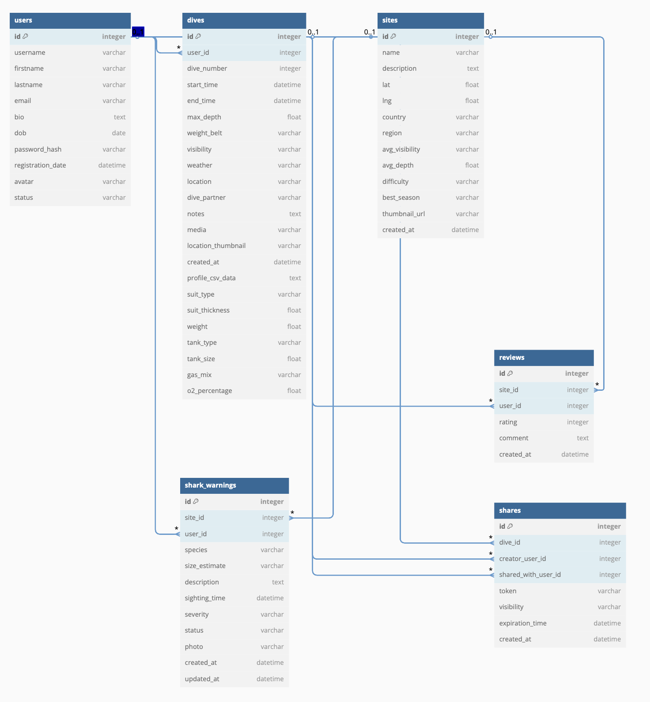

# DiveLogger

## Team Member

| Name            | Student Number | Github Username |
| --------------- | -------------- | --------------- |
| Jiaao Li        | 24140443       | Jaffrey29       |
| Kunhong Zou**** | 24257885       | KevinZ-24       |
| Ziyang Wen      | 23995281       | ZaneCodeJourney |
| Aadil Vagh      | 22791631       | aadilvagh       |

## Description

DiveLogger is a web application designed for scuba diving enthusiasts to log, manage, and share their diving experiences. Users can record detailed information about their dives, including location, conditions, equipment, and memorable moments. The platform also allows for the import of dive profile data from dive computers (via CSV) and the sharing of dive logs with fellow divers or publicly via shareable links. The goal of DiveLogger is to provide a comprehensive and user-friendly tool for divers to keep a digital record of their underwater adventures and connect with the diving community.

## Features

  - **User Account Management**: Secure registration, login, and profile management.
  - **Dive Logging**: Create, view, edit, and delete detailed dive logs.
  - **Comprehensive Dive Details**: Record information such as dive number, date, start/end times, max depth, location, dive partner, weather conditions, visibility, suit type, tank details, and personal notes.
  - **Media Uploads**: Attach photos or other media files to dive logs.
  - **CSV Dive Profile Import**: Upload and visualize dive profile data from dive computers (e.g., time, depth, temperature).
  - **Data Visualization**: View dive profile data graphically (feature to be fully implemented).
  - **Dive Sharing**:
    - Share dive logs selectively with other registered users.
    - Generate public, shareable links for dive logs with optional expiration dates.
  - **Shared Dives Feed**: View dive logs that have been shared with you by other users.
  - **Intuitive User Interface**: Easy-to-navigate design for a seamless user experience.
  - **API Endpoints**: A RESTful API for programmatic access to dive data and functionalities.

## Architecture Summary

DiveLogger is built using the following technologies:

  - **Frontend**: HTML, CSS, JavaScript
  - **Backend**: Flask
  - **Database**: SQLite (accessed via SQLAlchemy)

  ### Design and Use

**Engaging Design**: The application is designed with an intuitive and attractive interface using HTML, CSS, and Bootstrap to ensure users stay focused on the important elements of the application.

**Effective Use**: The features provided are aimed at producing value for the users by allowing them to share knowledge, get answers to their questions, and participate in meaningful discussions.

**Intuitive Navigation**: The interface is user-friendly, making it easy for users to navigate through the application, search for threads, create posts, and interact with other users.

## API Documentation
  | Endpoint | Method | Description | Parameters | Response |
  |----------|--------|-------------|------------|----------|
  | `/api/auth/register` | POST | Register a new user | `username`, `email`, `password`, `confirm_password` | User details with JWT token |
  | `/api/auth/login` | POST | Login user | `username/email`, `password` | User details with JWT token |
  | `/api/auth/logout` | POST | Logout user | None | Success message |
  | `/api/dives` | GET | Get all dives for logged in user | None | List of dive objects |
  | `/api/dives` | POST | Create a new dive | Dive details (date, location, depth, etc.) | Created dive object |
  | `/api/dives/<id>` | GET | Get specific dive by ID | None | Dive object |
  | `/api/dives/<id>` | PUT | Update specific dive | Updated dive details | Updated dive object |
  | `/api/dives/<id>` | DELETE | Delete specific dive | None | Success message |
  | `/api/dives/<id>/share` | POST | Share dive with another user | `username` | Share details |
  | `/api/dives/<id>/public-share` | POST | Create public share link | `expiry_date` (optional) | Public share URL |
  | `/api/shared-dives` | GET | Get dives shared with current user | None | List of shared dive objects |
  | `/api/dive-sites` | GET | Get all dive sites | None | List of dive site objects |
  | `/api/sharks/report` | POST | Report shark sighting | Sighting details (site, species, size, etc.) | Created report object |
  | `/api/sharks/warnings` | GET | Get shark warnings | `site_id` (optional), `date_range` (optional) | List of warning objects |

## ER Diagram

  

The main entities and relationships are as follows:

  - **User**: Stores user account and profile information.
  - **Dive**: Each dive log, linked to a user, with detailed fields and optional media/CSV data.
  - **Site**: Dive site directory, with location, description, and reviews.
  - **Review**: User reviews for dive sites.
  - **Share**: Sharing permissions and public links for dive logs.
  - **SharkWarning**: Shark sighting reports at dive sites.

**Simplified ER Diagram:**

  ```
  User 1---* Dive *---* Share
    |         |
    |         *---* Media/CSV
    *---* Review
  Site 1---* Review
  Site 1---* SharkWarning
  User 1---* SharkWarning
  ```

## How to Launch the Application

  1. **Clone the Repository**

     ```bash
     git clone https://github.com/ZaneCodeJourney/CITS5505-Group-Project.git
     ```

     This command clones the DiveLogger repository to your local machine.

  2. **Navigate to the Project Directory**

     ```bash
     cd CITS5505-Group-Project
     ```

  3. **Install Dependencies**
     Since DiveLogger is a Python-based project, you might need to set up a virtual environment first:

     ```bash
     python3 -m venv venv # or python -m venv venv
     source venv/bin/activate  # On Windows use `venv\Scripts\activate`
     ```

     Then install the required Python packages:

     ```bash
     pip install -r requirements.txt
     ```

  4. **Set Up the Database**

     ```bash
     flask db init # No need to run since the migration folder is uploaded to git
     flask db migrate -m "Initial migration." # No need to run since migration folder is uploaded to git
     flask db upgrade
     ```

  5. **Run the Application**

     ```bash
     flask run
     ```

     This command will start the Flask server on `http://127.0.0.1:5000/`.

## Instructions to Run Tests

To ensure the reliability and functionality of DiveLogger, we've included comprehensive test suites using both Python's unittest framework and Selenium for browser-based testing.

  ### Unittest Test Cases

The unittest test suite verifies the backend functionality of various components including authentication, dive log operations, user models, and CSV data handling.

    Running Unittest Tests

  1. Make sure your virtual environment is activated:
     ```bash
     source venv/bin/activate  # On Windows use `venv\Scripts\activate`
     ```

  2. Run the complete test suite:
     ```bash
     python -m tests.run_tests
     ```

  3. To run all unittest tests:
     ```bash
     python -m unittest discover -s tests/unittest -p "test_*.py"
     ```

  4. To run a specific test file (examples):
     ```bash
     python -m unittest tests.unittest.test_auth
     python -m unittest tests.unittest.test_user_model
     python -m unittest tests.unittest.test_dive
     ```

  ### Unittest Test Coverage

The unittest suite includes the following test files:

  1. **Authentication Tests** (`tests/unittest/test_auth.py`)
     - User registration validation (username, email, password)
     - Login functionality with valid/invalid credentials
     - Password reset flow
     - Logout functionality
     - Run with: `python -m unittest tests.unittest.test_auth`
  2. **User Model Tests** (`tests/unittest/test_user_model.py`)
     - Password hashing verification
     - User representation
     - User-dive relationship
     - Run with: `python -m unittest tests.unittest.test_user_model`
  3. **Dive Tests** (`tests/unittest/test_dive.py`)
     - Dive creation with required fields
     - Dive retrieval by user
     - Dive update operations
     - Dive deletion (including associated shares)
     - Run with: `python -m unittest tests.unittest.test_dive`

  ### Selenium Testing

Selenium tests verify the application's frontend functionality by automating browser interactions.

    #### Running Selenium Tests

  1. Make sure your virtual environment is activated:
     ```bash
     source venv/bin/activate  # On Windows use `venv\Scripts\activate`
     ```

  2. Ensure the Flask application is running in a separate terminal:
     ```bash
     flask run
     ```

  3. Run all Selenium tests:
     ```bash
     python -m unittest discover -s tests/selenium -p "test_*.py"
     ```
     
  4. To run specific Selenium test files:
     ```bash
     python -m unittest tests.selenium.test_auth_selenium
     python -m unittest tests.selenium.test_dive_selenium
     python -m unittest tests.selenium.test_share_selenium
     ```

  #### Selenium Test Coverage

The Selenium test suite includes:

  1. **Authentication Tests** (`tests/selenium/test_auth_selenium.py`)
     - Login page loading and form validation
     - Registration form validation (including password matching)
     - Navigation between authentication pages
     - Password reset workflow
     - Run with: `python -m unittest tests.selenium.test_auth_selenium`

  2. **Dive Log Tests** (`tests/selenium/test_dive_selenium.py`)
     - Creating new dive logs with required fields
     - Form validation for dive log entries
     - Viewing created dive logs
     - Navigation through the application
     - Run with: `python -m unittest tests.selenium.test_dive_selenium`
     
  3. **Share Functionality Tests** (`tests/selenium/test_share_selenium.py`)
     - Sharing dive logs with specific users
     - Creating public share links
     - Error handling for sharing with nonexistent users
     - Recipient viewing shared dive logs
     - Authentication requirements for sharing functionality
     - Run with: `python -m unittest tests.selenium.test_share_selenium`

These tests ensure that both the backend functionality and user interface work correctly, providing a reliable application experience.

## References

  1. OpenAI. (2024). ChatGPT. Chatgpt.com. [https://chatgpt.com/](https://chatgpt.com/)
  2. SQLite Tutorial - An Easy Way to Master SQLite Fast. (n.d.). SQLite Tutorial. [https://www.sqlitetutorial.net/](https://www.sqlitetutorial.net/)
  3. W3SCHOOLS. (2019). CSS Tutorial. W3schools.com. [https://www.w3schools.com/css/](https://www.w3schools.com/css/)
  4. W3Schools. (2018). HTML Tutorial. W3schools.com. [https://www.w3schools.com/html/](https://www.w3schools.com/html/)
  5. Reddit. (2024). Reddit. Reddit. https://www.reddit.com/


## Acknowledgements

Special thanks to all contributors, open-source libraries, and the diving community for their feedback and support.
